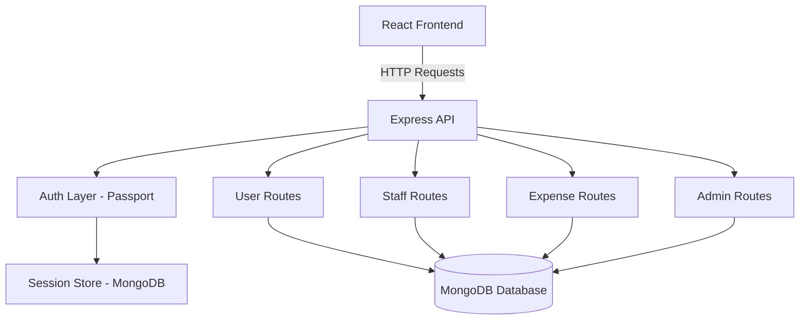
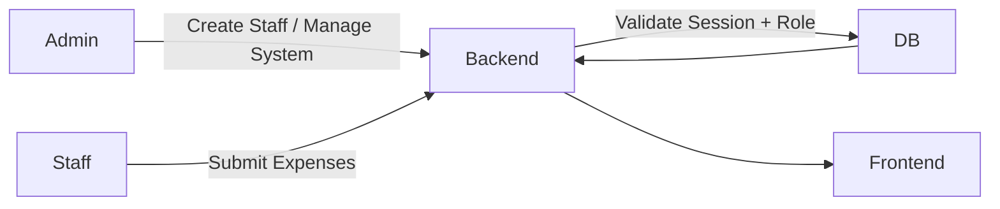

# 📊 Expense Manager – ERP-Style Staff & Expense Management System

<div align="center">

**A modern full-stack ERP-inspired platform for managing users, staff workflows, and expense tracking with secure authentication and role-based access.**

</div>

---

## 🎯 Overview

**Expense Manager** is a full-stack web platform inspired by ERP systems like Odoo, built to manage:

* 👥 Users and staff accounts
* 💰 Expense submissions and tracking
* 🛠 Admin controls and approvals
* 🔐 Secure authentication (Local + Google OAuth)
* 📊 Structured backend APIs for workflow automation

The system is designed to simulate a lightweight enterprise workflow where admins manage staff, staff submit expenses, and authentication is handled securely through sessions and OAuth.

The backend runs on **Node.js + Express**, with **MongoDB** session storage and database integration, while the frontend uses **React + Vite + Tailwind** for a fast modern UI. ([GitHub][1])

---

## 🚀 Key Features

### 🔐 Authentication System

* Email/password login
* Google OAuth login integration
* Session-based authentication
* Secure cookie handling

### 👨‍💼 Role-Based System

* Admin routes for management operations
* Staff routes for non-admin workflows
* User accounts stored in database
* Permission-based API routing

### 💰 Expense Management

* Expense submission endpoints
* Staff expense tracking
* Admin monitoring routes
* Structured REST APIs

### 🧾 ERP-Style Backend Modules

* User management module
* Staff management module
* Expense module
* Admin control module

---

## 🛠 Tech Stack

### Frontend

* React 
* Vite
* Tailwind CSS
* React Router
* Axios

### Backend

* Node.js
* Express.js
* MongoDB
* Passport.js (Local + Google OAuth)
* Express Sessions
* Connect-Mongo session store

---

## 🏗️ System Architecture



### 🔁 Workflow Example



---

## 📦 Project Structure (Simplified)

```
OdooIITGadhinagar/
│
├── frontend/
│   ├── src/
│   ├── package.json
│
├── backend/
│   ├── routes/
│   ├── models/
│   ├── config/
│   ├── server.js
│   ├── package.json
│
└── README.md
```

### Architecture Style

This project follows a **modular backend pattern** similar to an MCP structure:

* **Models** → database schemas
* **Routes** → API endpoints
* **Config** → DB & server setup
* **Server entry** → app bootstrap

This keeps the system scalable and ERP-ready.

---

## 🔧 Installation & Setup

### 1️⃣ Clone Repo

```bash
git clone https://github.com/jenil1236/OdooIITGadhinagar.git
cd OdooIITGadhinagar
```

---

### 2️⃣ Backend Setup

```bash
cd backend
npm install
npm start
```

Backend runs on:

```
http://localhost:5000
```

---

### 3️⃣ Frontend Setup

```bash
cd frontend
npm install
npm run dev
```

Frontend runs on:

```
http://localhost:5173
```

---

## 🌍 Environment Variables

Create `.env` in backend:

```env
PORT=5000
MONGODB_URI=your_mongodb_connection
SESSION_SECRET=your_secret
SECRET=your_crypto_secret

GOOGLE_CLIENT_ID=your_google_client_id
GOOGLE_CLIENT_SECRET=your_google_client_secret
```

---

## 🎯 Why This Project Stands Out

* ✔ Real ERP-style architecture
* ✔ Google OAuth + session authentication
* ✔ Role-based backend routing
* ✔ Clean modular backend structure
* ✔ Modern React + Vite frontend
* ✔ Production-style MongoDB session storage

This is not just a CRUD app — it demonstrates **enterprise workflow design, authentication strategy, and modular backend architecture**.
